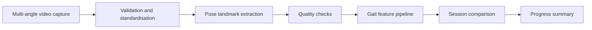

# Stroke Gait Analysis — Portfolio Showcase

> A privacy-conscious computer-vision project for analysing walking videos and tracking gait-related movement over time.

## Why I built it

Stroke rehabilitation teams often need a clear, repeatable way to observe changes in walking quality between sessions. This project explores how pose estimation and structured gait metrics can turn ordinary multi-angle walking videos into understandable progress indicators.

This repository is a portfolio showcase. It describes the engineering work and presents fabricated example outputs without publishing the proprietary implementation, participant recordings, clinical records, model logic, or scoring methodology.

## What the private system does

1. Validates and standardises videos captured from several camera angles.
2. Extracts body pose landmarks frame by frame.
3. Derives movement features such as joint motion, alignment, symmetry, and stability.
4. Compares sessions to highlight changes over time.
5. Produces structured summaries that can support professional review.

## Engineering highlights

- Multi-stage Python data pipeline with clear intermediate outputs
- Video processing and pose-landmark extraction
- Multi-view gait feature engineering
- Step-event detection and temporal summaries
- Baseline-to-session and session-to-session comparison
- Data-quality and landmark-visibility checks
- Privacy-aware separation of source code, participant data, and portfolio material

## High-level architecture

The production implementation, thresholds, formulas, scoring rules, and participant-level data are intentionally omitted.

## Example output

The sample in [`examples/portfolio_summary.csv`](examples/portfolio_summary.csv) is entirely fabricated. It demonstrates the type of recruiter-safe output the system can produce without identifying a real person or disclosing the underlying calculation method.

## Technology

- Python
- OpenCV-style video processing
- Pose-estimation workflows
- JSON and CSV data pipelines
- Statistical and temporal gait analysis

## Responsible-use boundaries

This project is an engineering and decision-support prototype. It is not a medical device, does not provide a diagnosis, and should not replace assessment by a qualified healthcare professional. Any real-world use would require clinical validation, governance, security review, informed consent, and compliance with applicable health-data requirements.

## Intellectual property

Copyright © 2026 Qasim. All rights reserved.

The underlying source code, algorithms, scoring methodology, system configuration, datasets, and documentation are proprietary and are not licensed through this showcase. See [`NOTICE.md`](NOTICE.md).

## Recruiter or investor access

A guided demonstration or deeper technical discussion can be provided privately where appropriate. Access to confidential materials is considered separately and may require a non-disclosure agreement.

